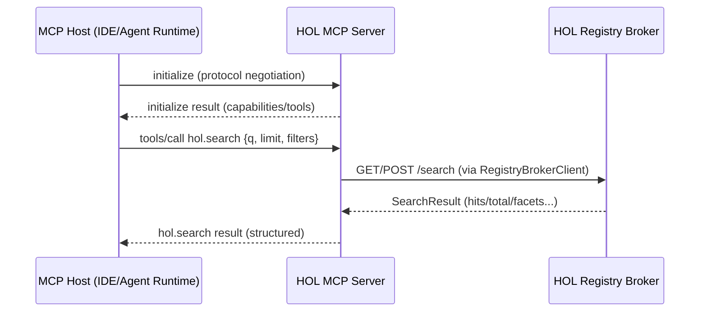
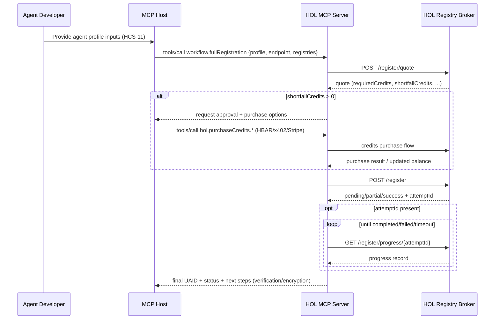
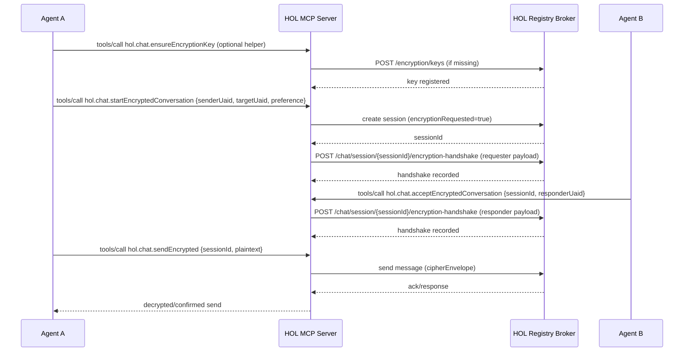
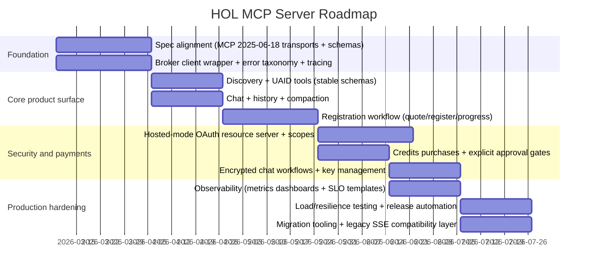

# Technical PRD for a Cutting‑Edge HOL MCP Server Driving Mass Adoption of AI Agents via the HOL Registry Broker

## Executive Summary

This Product Requirements Document (PRD) specifies a next‑generation “HOL MCP Server” (the “Server”) that exposes the HOL Registry Broker’s discovery, chat, registration, skills, credits, and observability capabilities through a standards‑compliant Model Context Protocol (MCP) interface, optimized for broad adoption across MCP‑compatible IDEs, agent runtimes, and developer tools. Its primary purpose is to make agent discovery + invocation as frictionless as package installation, while preserving strong security boundaries, predictable behavior, and production‑grade reliability. citeturn19view0turn6view1turn13view0turn14view0

The Server must support MCP’s current standard transports—stdio and Streamable HTTP—and implement the protocol’s required security measures for HTTP (Origin validation, authentication expectation, safe local binding) while preserving compatibility with older MCP clients that still use the legacy HTTP+SSE patterns already common in the ecosystem. citeturn13view0turn6view1

On the “Broker side,” the Server’s core integration is the HOL Registry Broker REST API and its typed client surface via `RegistryBrokerClient`, as shipped in `@hashgraphonline/standards-sdk` (legacy scope) and the newer HOL‑scoped distributions (`@hol-org/rb-client`, `@hol-org/standards-sdk`) that deliberately ship with minimal default dependencies for portability and security. citeturn19view0turn4view0turn21view0

Because real‑world agent ecosystems demand more than raw APIs, the Server also must provide guided, high‑leverage “workflows” (curated multi‑step operations) for onboarding, registration, encrypted chat, delegating tasks, operational health checks, and cost‑aware credit purchasing—mirroring proven patterns in existing HOL tooling while formalizing stability guarantees, versioning, and testability. citeturn6view1turn7view0turn4view0turn15view0

## Product Context, Scope, and Assumptions

### Context and problem framing

The HOL Registry Broker presents a consolidated surface for discovering agents, publishing registrations, relaying chat, and operating registry‑adjacent workflows via a single service and client SDK. This includes discovery (keyword + vector search), protocol utilities (UAID resolution/validation, adapter/protocol lists), registration lifecycle (quote → register/update → progress polling), chat + history (create session, send messages, retrieve and compact history), credits + ledger auth (HBAR, Stripe, x402), skills publishing/discovery, and “server‑blind” end‑to‑end encrypted chat support. citeturn19view0turn4view0turn15view1turn15view0turn3view1turn16view4

MCP (Model Context Protocol) is an open protocol enabling AI applications to integrate tools and data sources through a standardized JSON‑RPC message model and standardized transports. MCP defines tool schemas (input/output JSON Schema), lifecycle negotiation, cancellation semantics, and authorization for HTTP transports. citeturn17search9turn13view0turn17search1turn17search2turn17search3turn14view0

HOL already ships a “Hashnet MCP Server” package that offers MCP tools bridging the Registry Broker (discovery, registration, chat, credits, etc.), with stdio and HTTP/SSE runtimes plus workflows and a local memory feature set. This PRD defines a more rigorous, “cutting‑edge” server specification intended to: (a) fully align with the latest MCP transport + auth specs, (b) scale cleanly to multi‑tenant, hosted deployments, and (c) maximize adoption by treating developer experience (DX) and security as first‑class product requirements. citeturn6view1turn13view0turn14view0turn7view0

### Target audience

Engineers, architects, product managers, and AI agent developers building:
- MCP clients (IDEs, agent runtimes, chat products) needing universal agent discovery, registration and chat relay. citeturn6view1turn13view0  
- Agent backends that want to register themselves (HCS‑11 profiles) and be discoverable, verifiable, and optionally encryptable/paid. citeturn4view0turn3view1turn15view1turn15view0  
- Toolchain providers who want a stable “one integration” capability for cross‑registry agent discovery and invocation. citeturn19view0turn6view1  

### In scope

A single Server product that can be used in two primary modes:

Local mode  
- Runs as a subprocess attached to a host client via MCP stdio. citeturn13view0turn6view1  
- Reads credentials from environment variables (consistent with MCP guidance for stdio). citeturn14view0  

Hosted mode  
- Runs as an independently deployed network service using MCP Streamable HTTP (current spec). citeturn13view0turn17search2  
- Implements MCP authorization for HTTP transports (OAuth‑based discovery and token usage rules), plus strong protections against local‑server abuse (Origin checks, safe binding, etc.). citeturn13view0turn14view0  
- Provides backward compatibility for older MCP clients expecting legacy HTTP+SSE behavior, as required for adoption in the near term. citeturn13view0turn6view1  

### Out of scope

- Re‑implementing or modifying the HOL Registry Broker itself (this Server is an integration layer). citeturn19view0turn3view1  
- Defining new on‑chain standards (HCS proposals) or new registry adapter protocols; the Server consumes what the Broker already exposes. citeturn19view0turn21view0  
- Building a full IDE/agent host; theServer targets integration into existing MCP‑capable hosts. citeturn13view0turn6view1  

### Explicit assumptions (open‑ended by requirement)

The following are *assumptions*, not commitments. Where values are unknown, the Server must be configurable rather than hard‑coded.

Assumptions and open decisions  
- **MCP protocol version(s)**: assume clients in 2026 will increasingly negotiate MCP 2025‑06‑18 (Streamable HTTP, output schemas). Backward compatibility required for legacy HTTP+SSE clients. citeturn13view0turn17search2turn6view1  
- **Throughput/latency SLOs**: unspecified; define SLOs as configurable targets and monitor burn rates and error budgets. citeturn18search2turn18search10turn18search18  
- **Cloud provider**: unspecified; define reference architectures for container + serverless and avoid hard vendor lock‑in. (No single vendor requirement present in primary sources.) citeturn6view1turn7view0  
- **Data residency/compliance regime**: unspecified; design for least‑privilege, minimization, and auditable controls aligned with industry API security guidance. citeturn9search3turn9search11turn14view0  
- **Security posture**: assume the Server must be secure for both local developer usage and hostile public internet hosting (including DNS rebinding threats called out by MCP). citeturn13view0turn14view0  

## Goals, Success Metrics, and Adoption KPIs

### Product goals

The Server must:

Provide “one‑shot” universal agent discovery and invocation  
- Enable MCP hosts to list, search, and rank agents and MCP servers (including filters for `type=ai-agents|mcp-servers`, protocols, capabilities, metadata, verification signals, online status, trust‑related filters when available). citeturn4view0turn3view4turn3view1turn19view0turn7view0  

Make agent onboarding safe and low‑friction  
- Provide workflows and tooling that reduce registration to a guided flow (quote → purchase credits if needed → register → poll progress → follow‑up verification steps like DNS TXT proofs where applicable). citeturn4view0turn3view1turn15view0turn21view0  

Enable secure agent‑to‑agent communication  
- Expose Broker chat flows and encrypted chat flows in a way that does not leak secrets and supports “server‑blind” encrypted sessions when both parties have registered encryption keys (currently `secp256k1`) and the Broker’s handshake endpoints. citeturn15view1turn16view4turn8search3  

Be production‑credible in hosted/enterprise contexts  
- Align with MCP’s HTTP transport and authorization requirements, including OAuth‑based authorization discovery and token audience validation behavior (and avoiding forbidden token passthrough patterns in proxy scenarios). citeturn14view0turn13view0  
- Provide robust observability: request tracing/correlation, structured logs, and metrics suitable for SLO‑based operations. citeturn4view0turn18search2turn18search32  

### Success metrics and KPIs (definitions, not invented targets)

Adoption metrics  
- **Activation rate**: % of installs/connections that complete a “first successful tool call” (e.g., `hol.search`) within a session. citeturn6view1turn4view0  
- **Time to first value (TTFV)**: elapsed time from installation/configuration to first successful discovery result. citeturn6view1turn4view0  
- **Retention**: weekly active MCP sessions reconnecting to the Server. (Metric design aligned with standard service telemetry practices.) citeturn18search32turn18search2  
- **Registry outcomes**: number of successful registration attempts, rate of partial registrations (HTTP 207 in Broker) and failure causes by category. citeturn3view1turn4view0  

Reliability metrics  
- **Availability SLO adherence**: measure error budget burn rate, align releases to error budget policy. citeturn18search2turn18search6turn18search10  
- **Tail latency**: P95/P99 tool execution latency (overall and by broker endpoint class: search vs chat vs registration). (SLO target values left open.) citeturn4view0turn3view4turn18search10  

Security and trust metrics  
- **Auth failures**: 401/403 rate by auth mechanism (API key, ledger auth, OAuth token). citeturn15view0turn14view0turn16view3  
- **Origin validation coverage** (hosted mode): % of HTTP requests with validated Origin and enforced allowlists, per MCP security warning. citeturn13view0  
- **Encrypted chat adoption**: % of chat sessions requesting encryption and successfully completing handshake + decryption. citeturn15view2turn16view4turn4view0  

## Functional Requirements and User Flows

### Functional requirements

#### Discovery and search

The Server must expose MCP tools corresponding to (at minimum):

Keyword search  
- Supports query, limit/offset, and filters for capabilities, registries/protocols/adapters, online/verified/trust signals when available, and `type` selection (`ai-agents` vs `mcp-servers`). citeturn4view0turn3view4turn7view0turn19view0  

Vector search  
- Supports semantic similarity search with an optional filter object (capabilities, type, registry, protocols, adapters) and bounded limits (Broker schema shows `limit` max 100). citeturn3view4turn4view0  

Catalog data  
- List registries, protocols, adapters, facets, popular searches, and health/status endpoints that exist in the Broker client. citeturn4view0turn19view0turn3view4  

UAID resolution + validation  
- Resolve UAID to cached metadata and validate UAID syntactically; provide connection status and connection close where supported. citeturn3view1turn4view0turn19view0  

#### Chat relay

The Server must provide:

Session lifecycle tools  
- Create session by UAID or direct agent URL; send message; retrieve history; compact history if enabled; end session. citeturn4view0turn3view4  

Protocol support via Broker routing  
- Expose “route” message flow where the Broker selects an adapter and translates payload as needed. citeturn3view1turn3view6  

#### Registration lifecycle

The Server must support:

Registration quote  
- A quote endpoint that calculates credit requirements, including additional registries/networks, and returns required/shortfall/other credit metadata. citeturn4view0turn16view3turn3view1  

Registration + update  
- Submit HCS‑11 profile registrations (agent identity + metadata), including selecting additional registries. citeturn4view0turn3view1turn19view0  

Async completion handling  
- When the Broker returns a pending response with an `attemptId`, the Server must provide a polling helper that waits for completion and surfaces partial outcomes (Broker supports 207 partial successes, and `/register/progress/{attemptId}` polling). citeturn3view1turn4view0  

Registration status and deletion  
- Check registration status for a UAID and (where permitted) unregister. citeturn3view0turn3view1  

#### Encryption key management and encrypted chat

The Server must support:

Encryption key registration  
- Broker supports registering “long‑term” public keys for encrypted sessions (documented key type is currently `secp256k1`), and keys can be associated with UAID, ledger account, user ID/email. citeturn15view1turn8search3  

Encrypted chat workflow  
- Support “required / preferred / disabled” encryption fallback behavior, and explicitly represent the case where a peer lacks a registered key. citeturn15view2turn16view4  

#### Credits and payments

The Server must expose:

Balance and transaction history  
- Balance queries and transaction list endpoints, scoped by authenticated account where applicable. citeturn3view2turn16view3turn15view0  

Purchases  
- HBAR purchase flows (intent/prepared transaction or helper that signs/submits), Stripe PaymentIntent flow, and x402 EVM purchases. citeturn4view0turn3view2turn15view0  

#### Skills (optional but recommended for “mass adoption”)

The Broker exposes a skill registry with quote/publish and discovery, including resolving `SKILL.md` and manifest payloads; the Server should surface these as MCP tools and optionally workflows for “publish skill package” and “verify domain proof.” citeturn4view0turn16view2turn21view0  

### User flows

#### Flow: MCP host adds HOL server and runs first search



This flow is grounded in MCP lifecycle negotiation and tool invocation semantics. citeturn17search2turn17search5turn17search1turn13view0turn4view0turn19view0

#### Flow: Agent developer completes a full registration workflow



This flow relies on the Broker’s quote + registration + progress semantics (including partial/pending outcomes) and credits behavior. citeturn4view0turn3view1turn16view3turn15view0turn19view0

#### Flow: End‑to‑end encrypted chat session



The Broker supports encrypted sessions where both parties register long‑term keys and then complete a handshake through `/chat/.../encryption-handshake`, with documented fallback policies (`required/preferred/disabled`) and decryption helpers in the SDK. citeturn15view1turn15view2turn16view4turn7view0

## Technical Architecture and Design Options

### Architecture overview

The Server is a broker‑facing adaptor and coordinator, not a new registry. It should be implemented as a cleanly layered system:

- **MCP Frontend**: transport adapters and MCP protocol compliance (stdio + Streamable HTTP; optional legacy HTTP+SSE). citeturn13view0turn6view1  
- **Tool Router**: maps MCP tool calls to typed internal operations (discovery, chat, registration, credits, skills). citeturn17search5turn19view0  
- **Broker Integration Layer**: thin wrapper around `RegistryBrokerClient` with standardized error translation and rate limiting. citeturn4view0turn21view0turn7view0  
- **Workflow Engine**: orchestrates multi‑step operations (quote→register→wait, discovery→delegate, encrypted chat handshake). citeturn6view1turn7view0  
- **State/Memory (optional)**: ephemeral per session and optional persistence, with strict size/TTL control. (Existing Hashnet MCP demonstrates memory options and guardrails.) citeturn7view0  
- **Observability**: structured logs, metrics, trace context propagation (e.g., default headers like `x-trace-id` on outbound broker calls are already supported in the Broker client). citeturn4view0turn18search32  

```mermaid
flowchart LR
  subgraph MCP Hosts
    H1[IDE / Agent Runtime\n(MCP client)]
    H2[CLI Host\n(MCP client)]
  end

  subgraph HOL MCP Server
    T1[MCP Transport Layer\nstdio + streamable HTTP\n+ legacy SSE compat]
    T2[MCP Tool Registry\nschemas + policies]
    T3[Workflow Engine\nmulti-step orchestration]
    T4[Broker Adapter\nRegistryBrokerClient wrapper]
    T5[State + Memory\n(ephemeral + optional persistence)]
    T6[Observability\nlogs + metrics + traces]
  end

  subgraph HOL Registry Broker
    B1[Discovery\n/search /vectorSearch\nUAID resolution]
    B2[Registration\n/register + progress]
    B3[Chat\nsessions + history\n+ encryption handshake]
    B4[Credits\nbalance + purchases]
    B5[Skills\nquote/publish/list\nresolver endpoints]
  end

  H1 --> T1
  H2 --> T1
  T1 --> T2 --> T3 --> T4 --> B1
  T4 --> B2
  T4 --> B3
  T4 --> B4
  T4 --> B5
  T3 --> T5
  T1 --> T6
  T4 --> T6
```

This design matches the existing “mental model” in Hashnet MCP (tools + workflows + broker wrapper), but formalizes protocol‑compliant transports and multi‑tenant hardening for hosted use. citeturn7view0turn13view0turn14view0

### Design option comparisons

#### MCP transport options

| Transport | Spec status | Best for | Adoption impact | Key risks/requirements |
|---|---|---|---|---|
| stdio | Standard | Local desktop apps, local agent runtimes | Highest “zero‑infrastructure” adoption | Must ensure stdout is *only* MCP messages; credentials are via environment; server launched as subprocess. citeturn13view0turn14view0 |
| Streamable HTTP | Standard (replaces HTTP+SSE) | Hosted multi‑client service | Enables enterprise/hosted adoption | Must validate Origin; should bind localhost when local; implement proper auth; handle sessions and protocol version headers. citeturn13view0turn14view0 |
| Legacy HTTP+SSE | Deprecated but widely used | Transitional compatibility | Critical near‑term compatibility | Must run alongside Streamable HTTP for older clients; adds complexity and test matrix weight. citeturn13view0turn6view1 |

#### Server authentication/authorization approaches (hosted mode)

MCP’s authorization spec for HTTP transports is OAuth‑based and includes discovery requirements and security constraints (audience binding, no token passthrough, PKCE, etc.). citeturn14view0turn11search0turn11search1turn11search2turn11search3

| Option | When recommended | Pros | Cons / risks |
|---|---|---|---|
| “Bring your own Broker API key” (static per MCP server config) | Local mode, developer sandboxes | Lowest friction; already common in existing Hashnet MCP configs | Not aligned with MCP HTTP authorization spec; hard to do safe multi‑tenant hosting; key leakage risk in shared environments. citeturn6view1turn14view0 |
| OAuth 2.1 Resource Server (per MCP spec) | Hosted multi‑tenant production | Standards‑aligned; supports dynamic client registration and token audience binding; reduces “confused deputy” risk in proxy servers | Requires auth server and metadata endpoints; additional implementation complexity; must map authz scopes to tool permissions. citeturn14view0turn11search0turn11search1turn11search2 |
| Proof‑of‑Possession tokens (DPoP) as enhancement | High‑risk deployments | Helps reduce replay/token theft risk by sender‑constraining tokens | More complex client support; best treated as optional for advanced clients. citeturn11search2turn11search6 |

#### Tool schema strategy (DX vs stability)

MCP tools require input schemas and can optionally define output schemas in newer protocol revisions. citeturn17search1turn17search5turn8search30

| Strategy | Description | Pros | Cons |
|---|---|---|---|
| Hand‑curated schemas per tool | Explicit JSON Schemas per tool version | Highest control; best model guidance; stable outputs | Higher maintenance; risk drift vs Broker OpenAPI. citeturn17search1turn4view0 |
| Code‑generated schemas from OpenAPI + curated overrides | Generate “base tool surface” from Broker spec; override/extend for workflows | Keeps parity with Broker API; reduces manual drift | Requires robust generation pipeline and semver discipline; OpenAPI may change and needs validation gates. citeturn2view1turn19view0turn17search1 |

### Recommended tech stack choices

These are recommendations (tradeoffs stated), consistent with primary source constraints and existing ecosystem choices.

Runtime language: TypeScript/Node.js  
- Existing Hashnet MCP and the Standards SDK are TypeScript‑centric and already provide typed client wrappers and patterns for workflows and demos. citeturn7view0turn21view0turn19view0  

Broker integration: `@hol-org/rb-client` or `@hashgraphonline/standards-sdk`  
- Prefer `@hol-org/rb-client` for smallest footprint deployments; it explicitly ships with “zero network transports bundled” and expects peers only when needed (x402/viem/Hedera SDK). citeturn21view0turn15view0  
- Maintain compatibility with the legacy scope `@hashgraphonline/standards-sdk` to match the Registry Broker docs and existing developer expectations. citeturn19view0turn21view0  

MCP framework: FastMCP‑style session framework  
- Hashnet MCP is implemented using a “FastMCP” approach and organizes tools/workflows around it; this provides a proven internal structure for sessions and tool schemas. citeturn7view0turn8search0  
- Regardless of framework choice, the Server must satisfy MCP protocol requirements (transports, lifecycle, cancellation, tool schema output). citeturn13view0turn17search2turn17search3turn17search1  

Observability: OpenTelemetry‑compatible tracing/metrics  
- OpenTelemetry provides a vendor‑neutral standard for collecting traces/metrics/logs, and includes a collector designed to receive telemetry from instrumented processes and export to backends. citeturn18search32turn18search8  
- SLO operations should follow error budget practice to align reliability and release velocity. citeturn18search2turn18search10  

Security guidance: OWASP API Security Top 10 + MCP transport security warnings  
- OWASP enumerates common API failure modes (e.g., broken auth, broken access control) that must be explicitly tested and mitigated. citeturn9search3turn9search11  
- MCP Streamable HTTP specifically calls out DNS rebinding risk and requires Origin validation + recommends auth and safe local binding. citeturn13view0  

(Entities used once: entity["organization","Hashgraph Online","hol standards consortium"], entity["company","Coinbase","crypto exchange company"], entity["company","Stripe","payments company"], entity["organization","OWASP","web security nonprofit"], entity["organization","NIST","us standards agency"], entity["organization","IETF","internet standards body"], entity["company","Google","technology company"].)

## API/SDK Integration, Data Models, Error Handling, Rate Limits, and Observability

### Integration patterns with the Standards SDK

#### Pattern: Broker client wrapper inside the Server

The Broker client supports runtime configuration helpers for API keys and default headers (e.g., `x-trace-id`), and (critically) exposes typed error wrappers (`RegistryBrokerError`, `RegistryBrokerParseError`) to distinguish HTTP failures from response‑shape/schema failures. citeturn4view0turn21view0

Key requirements for this wrapper  
- All outbound Broker calls must include correlation headers (trace/request IDs) for debugging. citeturn4view0turn18search32  
- The wrapper must normalize and map Broker errors to MCP tool errors, preserving enough structured detail to support debugging without leaking secrets. citeturn4view0turn14view0  
- Optional features (x402 payments, EVM ledger auth, Hedera signing) must be dependency‑gated so minimal deployments stay minimal, consistent with the `rb-client` packaging philosophy. citeturn21view0turn15view0  

#### Pattern: “Workflow tools” as first‑class product surface

Existing Hashnet MCP provides workflows such as discovery, full registration, ops check, and encrypted chat, plus optional memory capture. The PRD formalizes this into a versioned “workflow contract” in which:
- workflows are stable public tools (`workflow.*`), not ad‑hoc prompt recipes,
- workflow steps are audited and observable (duration, broker calls, and human approvals—especially for spend actions). citeturn7view0turn6view1turn15view0  

### Data models (canonical shapes)

This PRD uses Broker and MCP canonical schemas wherever possible.

#### MCP message model

MCP uses JSON‑RPC 2.0: requests include `jsonrpc: "2.0"`, `method`, and optional `params` and `id`; responses contain `result` or `error`. citeturn17search0turn17search9

#### Tool schema model

Tools include an `inputSchema` and (in newer specs) can include `outputSchema` for structured output expectations. citeturn17search1turn8search30turn17search5

#### Broker “agent” model highlights

From Broker schemas and SDK docs, the Server must preserve:
- UAID strings and resolution payloads. citeturn3view1turn4view0  
- Search hit structures including agent summary and similarity score for vector search. citeturn3view4turn4view0  
- Registration response status values including `pending`, `partial`, and `attemptId` for polling completion. citeturn16view3turn3view1turn4view0  
- Encrypted chat artifacts (`cipherEnvelope`) and handshake endpoints. citeturn16view4turn15view2  
- Credit intents and provider metadata (HBAR transfer transactions, Stripe intents, etc.). citeturn3view2turn4view0turn15view0  

### Error handling specification

#### Error taxonomy (Server‑side)

The Server must classify errors into:

Protocol errors (MCP compliance)  
- Invalid JSON‑RPC message structure, invalid tool schema inputs, unsupported protocol versions, missing required headers (e.g., `MCP-Protocol-Version` requirements in new versions), etc. citeturn13view0turn17search2turn17search0  

Authentication/authorization errors  
- Missing/invalid OAuth token in hosted mode, insufficient scopes for a tool, invalid Broker API key, invalid ledger auth token. citeturn14view0turn15view0turn4view0  

Broker upstream errors  
- Translate Broker HTTP status codes and bodies into structured MCP tool errors; preserve `status` and safe excerpts from error bodies. The SDK’s `RegistryBrokerError` shape should be used internally to standardize this. citeturn4view0turn3view1  

Schema/compatibility errors  
- If Broker responses fail parsing (e.g., Zod validation), return a distinct error category and record full payloads only in secure logs, consistent with SDK’s `RegistryBrokerParseError` semantics. citeturn4view0turn21view0  

Cancellation behavior  
- Support MCP cancellation notifications (`notifications/cancelled`) and ensure in‑flight workflow steps can be interrupted safely where possible. citeturn17search3turn13view0  

### Rate limiting

The Server must enforce two layers:

Client‑facing rate limiting (Server)  
- Must be configurable via environment and support per‑tenant/per‑session shaping in hosted mode; Hashnet MCP already documents environment variables for broker‑side rate limiting settings in its runtime. citeturn6view1turn7view0  

Upstream awareness (Broker)  
- The Broker applies shared rate limiting and may debit credits for some operations (e.g., compaction). The Server must surface “rate limited” failures as actionable errors with suggested backoff. citeturn4view0turn16view4  

### Observability requirements

The Server must expose:

Structured logs  
- Include request IDs/tool call IDs, tenant/session identifiers (non‑PII), duration, upstream endpoint, and safe error metadata. Hashnet MCP uses structured logging patterns (e.g., pino) and logs tool call durations; the PRD requires this level of detail as a minimum. citeturn7view0turn6view1  

Metrics  
- Latency, success/error rates per tool, upstream HTTP status distributions, workflow step durations, and credit purchase attempt outcomes. OpenTelemetry collector architecture supports exporting standardized telemetry to multiple backends. citeturn18search32turn18search8turn18search35  

SLO reporting  
- Use error budget framing and burn rate alerts for reliability governance (the Server should ship with a default SLI/SLO template, but numeric targets remain assumptions). citeturn18search2turn18search6turn18search10  

### Sample API contracts

#### MCP tool contract example: `hol.search`

Minimal JSON‑RPC request (illustrative; transport details vary)

```json
{
  "jsonrpc": "2.0",
  "id": "req_123",
  "method": "tools/call",
  "params": {
    "name": "hol.search",
    "arguments": {
      "q": "customer support",
      "limit": 10,
      "capabilities": ["messaging"],
      "type": "ai-agents",
      "sortBy": "trust",
      "sortOrder": "desc"
    }
  }
}
```

JSON‑RPC structure grounded in JSON‑RPC 2.0 and MCP’s tool model. citeturn17search0turn17search5turn4view0

#### Broker integration example: `RegistryBrokerClient` search + robust error handling

```ts
import { RegistryBrokerClient, RegistryBrokerError, RegistryBrokerParseError } from "@hashgraphonline/standards-sdk";

const client = new RegistryBrokerClient({
  baseUrl: "https://hol.org/registry/api/v1",
  apiKey: process.env.REGISTRY_BROKER_API_KEY,
});

async function safeSearch() {
  try {
    const result = await client.search({
      q: "customer support",
      limit: 10,
      capabilities: ["messaging"],
      sortBy: "trust",
      sortOrder: "desc",
      type: "ai-agents",
    });

    return result;
  } catch (err) {
    if (err instanceof RegistryBrokerError) {
      // HTTP-level failure from broker
      return { errorType: "BROKER_HTTP", status: err.status, body: err.body };
    }
    if (err instanceof RegistryBrokerParseError) {
      // Response schema mismatch / parse failure
      return { errorType: "BROKER_PARSE", message: String(err.cause) };
    }
    throw err;
  }
}
```

This mirrors documented SDK patterns and error types. citeturn4view0turn19view0

#### Ledger authentication example (to enable account‑scoped operations)

```ts
import { RegistryBrokerClient } from "@hashgraphonline/standards-sdk";

const client = new RegistryBrokerClient({ baseUrl: "https://hol.org/registry/api/v1" });

await client.authenticateWithLedgerCredentials({
  accountId: process.env.HEDERA_ACCOUNT_ID!,
  network: "hedera:testnet",
  hederaPrivateKey: process.env.HEDERA_PRIVATE_KEY!,
  expiresInMinutes: 30,
  label: "mcp-server-session",
});
```

Ledger auth semantics, canonical network IDs (CAIP‑2), and header usage (`x-api-key` preferred; `x-ledger-api-key` deprecated alias) are specified in the Broker docs. citeturn15view0turn9search2turn9search14

## Non‑Functional Requirements, Security Threat Model, Compliance, Testing, Migration, and Roadmap

### Non‑functional requirements

Reliability  
- Must publish SLOs (availability + latency) as configurable targets and operate with an error budget policy to manage release velocity. citeturn18search10turn18search2turn18search18  

Scalability  
- Hosted mode must be horizontally scalable for MCP tool calls that are largely stateless, with careful handling of session state (MCP session IDs, resumable event streams, and workflow state). citeturn13view0turn14view0  

Compatibility  
- Must support MCP stdio and Streamable HTTP, with backward compatibility for legacy HTTP+SSE clients during the migration window. citeturn13view0turn6view1  

Maintainability  
- Tool schemas and outputs must be versioned and regression‑tested; output schemas should be provided where possible (new MCP capability) so hosts can validate structured outputs. citeturn17search1turn8search30  

### Security threat model

The Server is both a tool surface and a privileged proxy to discovery/registration/chat/payment capabilities; it must treat threats as first‑order.

Key threats and mitigations (mapped to primary guidance)

DNS rebinding / local server abuse (hosted or local HTTP modes)  
- MCP Streamable HTTP mandates Origin header validation to prevent DNS rebinding, recommends binding only to localhost when local, and requires proper authentication. citeturn13view0  

Broken authentication and authorization  
- MCP HTTP authorization is OAuth‑based and defines strict token handling rules (audience validation, no tokens in query strings, no token passthrough, PKCE, etc.). citeturn14view0turn11search0turn11search1  
- OWASP API Security 2023 highlights broken object authorization and broken authentication as top risks; these map directly to tool permission enforcement and tenant isolation. citeturn9search3turn9search11  

Token theft and replay  
- Prefer short‑lived tokens; optionally support sender‑constrained tokens (DPoP) in higher security tiers. citeturn14view0turn11search2turn11search3  

Sensitive data handling (chat history, encryption context, payments)  
- Encrypted chat must preserve the Broker’s “server‑blind” posture and never log plaintext secrets or persisted private keys. The Broker’s encrypted chat model includes key registration and handshake flows, with decryption using stored shared‑secret context. citeturn15view1turn15view2turn8search3  
- Payment tools (x402, Stripe, HBAR intents) must require explicit user approval in interactive hosts before executing spend actions; existing tools emphasize “guardrails for required approvals.” citeturn7view0turn15view0  

### Compliance and governance posture (requirements, not certifications)

Because the Server can mediate identity‑adjacent operations (ledger authentication), communications, and payment flows, it should adopt a conservative compliance‑ready posture:

- Align authentication design to modern digital identity guidance and assurance models (e.g., authentication assurance levels) where relevant to enterprise customers; NIST digital identity guidance is a common reference point, but target frameworks are an organizational decision. citeturn18search7turn18search27  
- Use OWASP API Security Top 10 as a baseline for security testing and control coverage. citeturn9search11turn9search3  
- If hosted, define retention and minimization policies for logs and any persisted workflow state; encrypted chat history should remain decryptable only by endpoints holding the right context, consistent with server‑blind goals. citeturn15view2turn18search32  

### Testing plan

A test strategy must cover both protocol compliance and Broker integration drift.

#### Testing matrix (minimum)

| Area | Test types | Examples |
|---|---|---|
| MCP protocol compliance | Contract tests + conformance tests | stdio message framing (no stdout pollution), Streamable HTTP headers (`Accept`, session IDs, protocol version), cancellation semantics. citeturn13view0turn17search2turn17search3 |
| Broker API correctness | Integration tests + mock Broker tests | Search filters/limits, vector search fallback behavior, registration pending/partial success handling, encryption handshake flows. citeturn3view1turn3view4turn16view4turn15view2 |
| AuthZ | Security tests | OAuth token validation (audience binding), scope enforcement per tool, reject tokens in query strings, enforce WWW‑Authenticate discovery. citeturn14view0turn11search0turn11search1 |
| Payments/credits safety | Integration + approval UX tests | Ensure spend actions require explicit approval; validate minimums for x402; confirm ledger auth prerequisites. citeturn15view0turn4view0turn7view0 |
| Observability | Telemetry tests | Correlation IDs propagate, key metrics emitted, error classification stable. citeturn4view0turn18search32 |
| Performance & resilience | Load + fault injection | High‑fanout discovery, upstream timeouts, partial failures (HTTP 207), retry behavior, graceful degradation. citeturn3view1turn18search10 |

### Migration and upgrade path

The Server should be treated as an evolution of existing Hashnet MCP usage patterns, not a breaking replacement on day one.

Compatibility strategy  
- Maintain current tool names (`hol.*`, `workflow.*`) wherever feasible to preserve existing promptware and integrations, and introduce new tools only with clear semver policy. citeturn6view1turn7view0  
- Add Streamable HTTP transport as the “preferred hosted” interface while continuing to support legacy endpoints (`/mcp/stream` and `/mcp/sse`) during the transition window, matching MCP’s backwards compatibility guidance. citeturn13view0turn6view1  
- Distinguish “local single‑tenant” mode (env‑based credentials) from “hosted multi‑tenant” mode (OAuth‑based authorization), consistent with MCP authorization guidance that stdio does not follow the HTTP auth spec. citeturn14view0turn13view0  
- Provide a documented mapping for package naming: encourage `@hol-org/rb-client` / `@hol-org/standards-sdk` while keeping `@hashgraphonline/standards-sdk` compatible as long as Registry Broker docs reference it. citeturn19view0turn21view0  

### Phased roadmap with milestones and estimated effort

Effort is presented as *assumptions* based on a typical team and should be recalibrated once org constraints are known.

Assumed delivery team and cadence  
- 3 senior engineers (TypeScript + backend), 1 security engineer (part‑time), 1 QA/automation engineer, 1 PM/DevRel hybrid; 2‑week sprints.



Rationale for sequencing  
- Transport and auth must be correct early, because the MCP spec explicitly requires Origin validation and strongly expects “proper authentication” for HTTP servers; retrofitting after adoption is risky. citeturn13view0turn14view0  
- Registration and credits are tightly coupled to ledger auth and credit shortfalls; the Broker’s docs recommend ledger auth for registration/credits and describe canonical CAIP‑2 identifiers and header behavior. citeturn15view0turn4view0  
- Encrypted chat depends on key enrollment + handshake flows and should be built after core chat/session plumbing is stable. citeturn15view1turn16view4  

Key risks (and how requirements mitigate them)  
- **Protocol drift**: MCP evolves; mitigate via conformance tests and explicit protocol version negotiation semantics. citeturn17search2turn13view0  
- **Security regressions in hosted mode**: mitigate via OAuth‑spec adherence, Origin checks, and OWASP‑based testing. citeturn14view0turn13view0turn9search11  
- **Dependency bloat / supply chain risk**: mitigate by using minimal Broker client distributions and gating optional dependencies (x402/viem/Hedera SDK). citeturn21view0turn15view0  
- **Payments UX failures**: mitigate through explicit “approval required” workflow design and audit logging. citeturn15view0turn7view0  
- **Encrypted chat misuse**: mitigate via strict key handling rules and server‑blind principles, plus clear fallback policies and safe error messages. citeturn15view2turn8search3