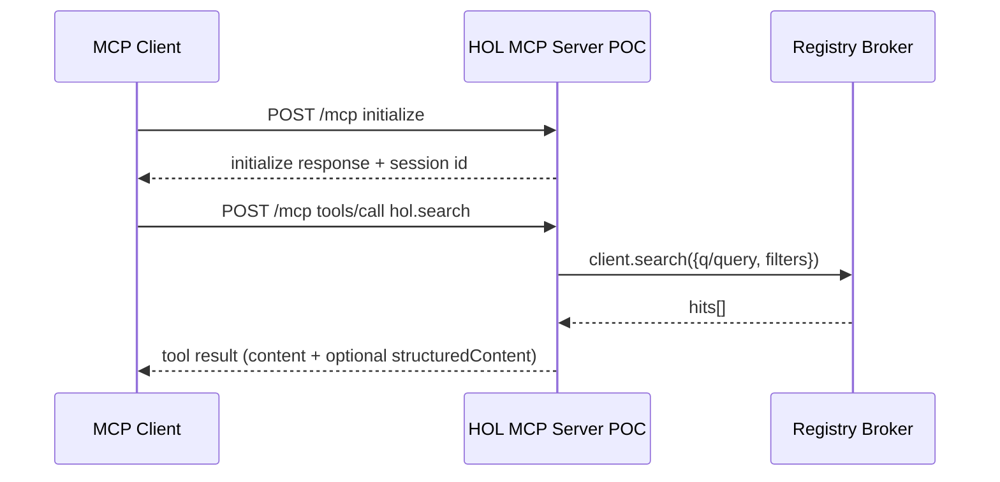

# Executable TODO List for a No‑Stubs HOL MCP Server POC

## Executive Summary

This report provides a highly technical, ordered, and executable TODO checklist for **Codex 5.3 AI** to build an initial, fully functioning (no stubs) proof‑of‑concept (POC) of the HOL MCP Server described in the provided PRD. The POC prioritizes (a) **real, live calls** to the Registry Broker via `@hashgraphonline/standards-sdk`, (b) **MCP spec compliance** for lifecycle + tools and **Streamable HTTP** transport with **legacy SSE compatibility**, and (c) pragmatic developer experience: reproducible local dev, CI, and end‑to‑end validation that proves no placeholders remain. citeturn16search0turn20view0turn1search0turn27view0turn24view0

The plan intentionally relies on proven patterns from the existing HOL Hashnet MCP reference implementation (scripts, dependency set, and tool surface), while upgrading the HTTP transport in the POC to align with the MCP **Streamable HTTP** transport spec and required security constraints (Origin validation, safe binding, authentication expectation). citeturn6view0turn24view0turn1search0turn19search8turn27view0

## Assumptions and POC Scope Boundaries

The user explicitly requested that missing details be stated as assumptions rather than invented values. The following assumptions constrain the POC to be “initial” yet “fully functioning” and “no stubs.”

Assumptions
- **Primary execution environment**: local developer machine, **Node.js 20+**, `pnpm` (or `npm`). Registry Broker docs recommend Node.js 20+ for current usage patterns. citeturn16search0turn16search2  
- **Cloud provider / hosted production**: out of scope for the POC; the POC will still provide a production‑shaped container‑friendly server but will not implement a full OAuth authorization server. (OAuth‑hardening is a Phase‑2 milestone; not included as stub code.) MCP’s HTTP authorization model is OAuth‑based, but locally the POC will use env‑based credentials consistent with MCP guidance for non‑HTTP transports and common dev setups. citeturn0search2turn27view0turn19search1  
- **Transport support**: POC must support:
  - MCP **stdio** transport for tools like Codex/desktop hosts. citeturn18view0turn1search0  
  - MCP **Streamable HTTP** at a canonical endpoint (recommended `/mcp`), plus **legacy HTTP+SSE** compatibility endpoints for older clients (mapped to `/mcp/sse` + `/mcp/messages`). citeturn27view0turn29view2turn1search0  
  - Compatibility aliases matching common HOL setups (e.g., `/mcp/stream`). citeturn18view0turn6view0  
- **Functional scope** (POC “vertical slice”): implement these capabilities end‑to‑end via live Broker calls:
  - Discovery: `hol.search`, `hol.vectorSearch`, `hol.resolveUaid`, `hol.stats`
  - Chat: `hol.chat.createSession`, `hol.chat.sendMessage`, `hol.chat.history`, `hol.chat.end`
  - Agent onboarding: `hol.getRegistrationQuote`, `hol.registerAgent`, `hol.waitForRegistrationCompletion`
  - Ops surface: basic health / connectivity check tool to prove Broker reachability (use `client.stats()` as the canonical connectivity check shown in docs). citeturn16search2turn6view0  
- **Non‑functional scope**: implement rate limiting, structured logging, test coverage, and explicit input validation and access controls guided by MCP tool security considerations and OWASP API Top 10 themes (e.g., object‑level authorization, broken auth). citeturn20view0turn1search5turn1search1turn1search13  

## Repo Blueprint and Dependency Bill of Materials

### Repository layout

Use a repo structure optimized for deterministic builds, modularity, and fast iterative work:

```text
hol-mcp-server-poc/
  .github/
    workflows/
      ci.yml
  docs/
    architecture.md
    acceptance.md
    threat-model.md
    runbooks.md
  scripts/
    e2e/
      streamable-http-smoke.ts
      stdio-smoke.ts
    tool-suite/
      run-tool-suite.ts
  src/
    cli/
      up.ts
    config/
      env.ts
      featureFlags.ts
    mcp/
      createServer.ts
      tools/
        discovery.ts
        chat.ts
        registration.ts
      workflows/
        discoveryWorkflow.ts
        registrationWorkflow.ts
      schemas/
        common.ts
    broker/
      client.ts
      errors.ts
      rateLimit.ts
    transports/
      stdio.ts
      httpStreamable.ts
      httpLegacySse.ts
      originValidation.ts
    observability/
      logger.ts
      telemetry.ts
    index.ts
  tests/
    unit/
      brokerErrors.test.ts
      toolSchemas.test.ts
    integration/
      brokerClient.mock.test.ts
      mcp.toolCalls.http.test.ts
  .env.example
  package.json
  pnpm-lock.yaml
  tsconfig.json
  tsup.config.ts
  vitest.config.ts
  README.md
  LICENSE
```

This mirrors proven layout in the existing HOL Hashnet MCP project (`src/`, `scripts/`, `tests/`, `tsup`, `vitest`, `.env.example`) while adding explicit “transports” and “broker” layers for clarity and auditability. citeturn6view0turn24view0

### Required NPM packages (exact names + minimum versions)

Use the dependency set validated by the existing Hashnet MCP implementation, updated to minimum versions that still track current releases.

Core runtime dependencies
- `@modelcontextprotocol/sdk` **>= 1.21.1** (recommended: latest 1.27.1 as of Feb 24, 2026) citeturn24view0turn9search2turn27view0  
- `zod` **>= 4.1.12** (MCP SDK uses `zod/v4` and maintains compatibility with Zod v3.25+; use v4 in this repo) citeturn27view0turn24view0  
- `@hashgraphonline/standards-sdk` **>= 0.1.139** (recommended: latest 0.1.150 as of Jan 22, 2026) citeturn24view0turn9search0  
- `dotenv` **>= 17.2.3** (explicitly recommended by Registry Broker installation guide patterns) citeturn16search2turn24view0  
- `pino` **>= 10.1.0** (structured logs; also used by Hashnet MCP) citeturn6view0turn24view0  
- `undici` **>= 7.16.0** (optional fetch polyfill; useful for runtime portability if `globalThis.fetch` behavior differs; Registry Broker docs explicitly mention `undici` as a polyfill option on older runtimes) citeturn16search2turn24view0  
- `bottleneck` **>= 2.19.5** (rate limiting; consistent with Hashnet MCP) citeturn24view0  

HTTP server (Streamable HTTP + legacy SSE)
- `express` **>= 4.18.x** (minimum pinned by your org; POC uses Express because MCP SDK provides explicit Express helpers and an official compatibility example) citeturn29view0turn27view0  

Dev/build/test toolchain
- `typescript` **>= 5.9.3** citeturn24view0  
- `tsx` **>= 4.20.6** citeturn24view0  
- `tsup` **>= 8.5.0** citeturn24view0  
- `vitest` **>= 2.1.4** and `@vitest/coverage-v8` **>= 2.1.4** citeturn24view0  
- `@types/node` **>= 24.10.0** citeturn24view0  

Optional deps (feature‑gated; do not import unless enabled)
- `better-sqlite3` **>= 11.5.0** — optional local persistence (Hashnet MCP uses this as an optional peer dependency) citeturn24view0  
- `ioredis` **>= 5.8.2** — optional Redis persistence / distributed session state (present in Hashnet MCP devDependencies; gate behind flag) citeturn24view0  
- `@hashgraph/sdk` **>= 2.80.0** — optional Hedera transaction signing utilities if you later implement direct credit purchase flows; the package exists and is actively published. citeturn9search4turn4search10  

### Required inputs (env vars / API keys)

Create `.env.example` with explicit notes, following Registry Broker installation guidance.

Minimum required for live Broker calls
- `REGISTRY_BROKER_API_URL` (default `https://hol.org/registry/api/v1`) citeturn16search0turn16search2  
- `REGISTRY_BROKER_API_KEY` (optional for search‑only; required for paid endpoints like chat/registration) citeturn16search2turn16search3turn18view0  

Optional (ledger authentication / credit operations / demos)
- `HEDERA_NETWORK` (`testnet` or `mainnet`) citeturn16search2  
- `HEDERA_ACCOUNT_ID`, `HEDERA_PRIVATE_KEY` (used for ledger auth credentials helper) citeturn16search2turn16search0  
- `ETH_PK`, `EVM_LEDGER_NETWORK` (EVM ledger auth/credits path supported by Registry Broker patterns) citeturn16search0turn16search2  

Optional (end‑to‑end encrypted chat workflows)
- `RB_ENCRYPTION_PRIVATE_KEY` (used by the SDK helper patterns for ensuring/initializing encryption capability) citeturn16search1turn16search2  

MCP server runtime configuration
- `MCP_TRANSPORT` = `stdio|http` (POC default: `http`)  
- `MCP_HOST` (default: `127.0.0.1` to follow MCP security guidance for local servers) citeturn1search0turn20view0  
- `MCP_PORT` (default: `3333`)  
- `MCP_ALLOWED_ORIGINS` (comma‑separated; default allowlist includes `http://localhost:*` and `http://127.0.0.1:*`; enforce “if Origin present and invalid → 403”) citeturn1search4turn1search0  
- `MCP_SERVER_BEARER_TOKEN` (if set, require `Authorization: Bearer ...` on HTTP transport; recommended for anything beyond localhost) citeturn1search0turn20view0turn0search2  

## Ordered Executable TODO Checklist

Each task is designed for direct execution by Codex 5.3 AI, with concrete deliverables, acceptance criteria, effort ranges, required inputs, and test cases. “Effort” assumes one senior engineer with full context; adjust for team/process overhead.

### Task 1 — Initialize repo, policy, and build system

Rationale: A deterministic build, consistent scripts, and a clean module structure prevent “stubs by entropy” and reduce later retrofit work.

1.1 Create repository skeleton and baseline configs  
- Deliverables:
  - Repo layout created (directories per blueprint)
  - `LICENSE` (Apache‑2.0 or org standard)
  - `README.md` with: overview, quickstart commands, env var matrix, transport notes, and “no stubs” validation instructions  
- Acceptance criteria:
  - `pnpm install` succeeds on clean machine
  - `pnpm build` produces `dist/` and `pnpm start` runs without runtime import errors  
- Effort: 2–6 hours  
- Test cases:
  - Fresh clone: install, build, run `pnpm -s start` and confirm process starts cleanly

1.2 Create `package.json` scripts (POC‑focused)  
- Required scripts (mirror proven Hashnet MCP scripts; update for Streamable HTTP):
  - `dev:stdio`: run stdio transport via `tsx`
  - `dev:http`: run Streamable HTTP server on localhost
  - `dev:http:compat`: run Streamable HTTP + legacy SSE compatibility endpoints
  - `build`: `tsup --config tsup.config.ts`
  - `start`: `node dist/index.js`
  - `test`, `test:run`, `test:coverage`: vitest equivalents
  - `smoke:http`: run `scripts/e2e/streamable-http-smoke.ts`
  - `smoke:stdio`: run `scripts/e2e/stdio-smoke.ts`
  - `lint` and `typecheck` (if your org requires; otherwise provide `pnpm -s typecheck`)  
- Acceptance criteria:
  - `pnpm dev:http` starts server at `http://127.0.0.1:3333/mcp` (or configured)
  - `pnpm test:run` executes (even if minimal tests exist initially)  
- Effort: 1–3 hours  
- References (script patterns & tool suite approach): citeturn24view0turn6view0  

1.3 Pin toolchain versions and Node requirements  
- Deliverables:
  - `engines.node` set to `>=20` (recommended by Registry Broker quickstart) citeturn16search0turn16search2  
  - `packageManager` set (pnpm recommended; Hashnet MCP uses modern pnpm) citeturn24view0turn16search0  
- Acceptance criteria:
  - Install fails fast with clear message on unsupported Node versions  
- Effort: 0.5–1 hour

### Task 2 — Implement configuration loading and feature flags

Rationale: Prevent runtime ambiguity and secret sprawl; make “what is enabled” explicit.

2.1 Implement strict env parsing  
- Deliverables:
  - `src/config/env.ts` exporting:
    - `loadEnv(): EnvConfig` (validates required vars per mode)
    - `redactEnvForLogs(env): SafeEnv` (no secrets)
  - `.env.example` including Registry Broker variables from official install/quickstart docs citeturn16search2turn16search0  
- Acceptance criteria:
  - Missing `REGISTRY_BROKER_API_URL` defaults to `https://hol.org/registry/api/v1` (documented) citeturn16search0turn16search2  
  - Missing `REGISTRY_BROKER_API_KEY` allows search tools but blocks paid tools with a clear MCP tool error message; docs note key is optional for search‑only usage citeturn16search2turn16search3  
- Effort: 2–5 hours  
- Test cases:
  - Unit tests for env parsing: missing/invalid values, redaction behavior

2.2 Implement feature flags  
- Deliverables:
  - `src/config/featureFlags.ts` with typed flags:
    - `FEATURE_LEGACY_SSE`
    - `FEATURE_MEMORY_SQLITE`
    - `FEATURE_MEMORY_REDIS`
    - `FEATURE_LEDGER_AUTH`
    - `FEATURE_ENCRYPTED_CHAT` (optional in later POC increments) citeturn16search1  
- Acceptance criteria:
  - Flags default OFF unless explicitly enabled
  - Optional deps are never imported unless their feature flag is ON (avoid runtime crashes in minimal installs)  
- Effort: 1–3 hours  
- Test cases:
  - Build without optional deps installed must still succeed

### Task 3 — Implement Registry Broker client wrapper with real requests

Rationale: The POC must prove “no stubs” by making live calls through the standards SDK (typed, validated, consistent errors).

3.1 Implement Broker client factory  
- Deliverables:
  - `src/broker/client.ts`:
    - `createRegistryBrokerClient(env: EnvConfig): RegistryBrokerClient`
    - sets `baseUrl` and `apiKey`
    - optional: sets default headers (e.g., app ID) as shown in docs citeturn16search2turn25search0  
- Acceptance criteria:
  - A simple script can call `client.stats()` and log totals (connectivity check pattern) citeturn16search2turn16search3  
- Effort: 1–2 hours  
- Required inputs:
  - `REGISTRY_BROKER_API_URL` and optionally `REGISTRY_BROKER_API_KEY` citeturn16search0turn16search2  

3.2 Standardize upstream error handling  
- Deliverables:
  - `src/broker/errors.ts`:
    - `toMcpToolError(err): { isError: true, content: [...] }`
    - specifically handles `RegistryBrokerError` and `RegistryBrokerParseError` (documented SDK behavior) citeturn16search3turn25search0  
- Acceptance criteria:
  - For a forced bad key, Broker 401 surfaces as tool execution error (not a crash)
  - For parse errors, tool returns “schema mismatch” message and logs diagnostic safely citeturn16search3turn25search0  
- Effort: 2–6 hours  
- Test cases:
  - Unit test: mock thrown `RegistryBrokerError` / parse error and verify mapping

3.3 Add rate limiting wrapper around Broker calls  
- Deliverables:
  - `src/broker/rateLimit.ts` using Bottleneck
  - `withRateLimit(fn)` helper applied to all tool broker calls  
- Acceptance criteria:
  - Concurrency and QPS caps configurable (env)
  - A load test script shows requests queue rather than fail spiky  
- Effort: 2–6 hours  
- Security note: Rate limiting aligns with MCP tool security guidance and OWASP considerations for abuse resistance. citeturn20view0turn1search5  

### Task 4 — Build MCP server core: lifecycle, tools/list, cancellation

Rationale: MCP requires initialization first, capability negotiation, tool listing, and correct tool call semantics. citeturn19search1turn20view0turn19search2

4.1 Implement MCP server creation and tool registration  
- Deliverables:
  - `src/mcp/createServer.ts` exports:
    - `createMcpServer(opts): McpServer`
    - registers server metadata: `{ name, version }`
    - declares tool capability (supports `tools/list`)
    - global instruction hint (server description)  
- Acceptance criteria:
  - `tools/list` returns all tools with `inputSchema`; use Zod->schema conversion via SDK patterns citeturn20view0turn27view0  
- Effort: 3–8 hours  
- Test cases:
  - HTTP smoke test: initialize → tools/list succeeds

4.2 Ensure cancellation compliance for long‑running operations  
- Deliverables:
  - Tool runner wrapper that can:
    - abort `hol.waitForRegistrationCompletion` polling when client sends cancellation  
- Acceptance criteria:
  - The server does not allow cancelling `initialize` (required by spec) citeturn19search2  
- Effort: 4–10 hours  
- Test cases:
  - Trigger cancellation during wait loop and confirm no further Broker calls

4.3 Tool output schema discipline  
- Deliverables:
  - Use `outputSchema` for at least one tool (e.g., `hol.stats`) and return both:
    - `structuredContent` (must conform) and
    - a JSON string in a text block for backward compatibility citeturn20view0  
- Acceptance criteria:
  - Tool results validate against `outputSchema`
  - On error paths, return `isError: true` and avoid invalid structuredContent per MCP tool error model citeturn20view0  
- Effort: 3–8 hours  
- Test cases:
  - Unit test validating structured output matches schema

### Task 5 — Implement stdio transport (Codex‑friendly)

Rationale: Stdio is the lowest‑friction adoption path for local tools, and is explicitly supported in HOL client setups. citeturn18view0turn1search0

5.1 Implement stdio transport wiring  
- Deliverables:
  - `src/transports/stdio.ts`:
    - `runStdio(server: McpServer): Promise<void>`
  - `src/index.ts` chooses transport based on `MCP_TRANSPORT` and/or CLI args  
- Acceptance criteria:
  - Works with a simple “stdio smoke” client script (spawn process, write JSON‑RPC `initialize`, read response)
  - Stdout contains only valid MCP JSON‑RPC frames (no stray logs; logs go to stderr or file)  
- Effort: 4–10 hours  
- Test cases:
  - `pnpm smoke:stdio` passes using live Broker for at least `hol.stats()` and `hol.search()`

### Task 6 — Implement Streamable HTTP transport + legacy SSE compatibility

Rationale: MCP deprecated legacy HTTP+SSE in favor of Streamable HTTP; the POC must implement Streamable HTTP and also provide backwards compatibility for older clients and common HOL endpoints. citeturn1search0turn27view0turn29view2turn18view0

6.1 Implement Origin validation and safe local binding  
- Deliverables:
  - `src/transports/originValidation.ts`:
    - `validateOrigin(req): void` that enforces:
      - if `Origin` present and invalid → `403` (per MCP guidance) citeturn1search4turn1search0  
  - Default `MCP_HOST=127.0.0.1` and document “do not bind 0.0.0.0 without auth” citeturn1search0  
- Acceptance criteria:
  - Requests with disallowed Origin get 403
  - Requests without Origin (non‑browser) still succeed  
- Effort: 2–5 hours  
- Test cases:
  - Curl with `Origin: https://evil.example` → 403

6.2 Implement Streamable HTTP endpoint(s) using SDK patterns  
- Deliverables:
  - `src/transports/httpStreamable.ts`:
    - Express app using the SDK’s Express helpers and `StreamableHTTPServerTransport`
    - endpoint supports `GET|POST|DELETE` at `/mcp`
    - adds alias route `/mcp/stream` mapped to same handler, matching common HOL client config citeturn18view0turn29view1  
  - Store transports by sessionId (`mcp-session-id` header usage) based on official reference pattern citeturn29view1turn19search8  
- Acceptance criteria:
  - `pnpm dev:http` starts successfully
  - `scripts/e2e/streamable-http-smoke.ts` can:
    1) POST initialize
    2) POST tools/list
    3) POST tools/call hol.stats
  - Server enforces `MCP-Protocol-Version` header on non‑initialize requests (required by transports spec) citeturn19search8  
- Effort: 6–16 hours  
- Test cases:
  - Missing `MCP-Protocol-Version` after init → deterministic error response

6.3 Implement legacy HTTP+SSE compatibility endpoints  
- Deliverables:
  - `src/transports/httpLegacySse.ts`:
    - `/mcp/sse` (GET) establishes SSE stream
    - `/mcp/messages` (POST) receives JSON‑RPC messages with `sessionId` query param
  - Feature‑flagged: only enabled when `FEATURE_LEGACY_SSE=1`  
- Acceptance criteria:
  - Legacy clients can connect (validate against the SDK’s compatibility example design) citeturn29view2turn27view0  
- Effort: 6–14 hours  
- Test cases:
  - Connect SSE, then POST `tools/list` through `/mcp/messages?sessionId=...`

### Task 7 — Implement core tools: Discovery

Rationale: Discovery is the lowest‑risk proof of full integration and supports adoption even without API keys (but higher rate limits and dedicated buckets may still benefit from a key). citeturn16search2turn25search4turn6view0

7.1 Implement `hol.stats` (connectivity + structured output)  
- Deliverables:
  - `src/mcp/tools/discovery.ts` registers `hol.stats`
  - Returns `structuredContent` matching `outputSchema` and json text fallback citeturn20view0turn16search2  
- Acceptance criteria:
  - Live call returns totals without throwing
- Effort: 2–4 hours  
- Test cases:
  - Live HTTP smoke: `hol.stats` returns expected keys and passes schema validation

7.2 Implement `hol.search` with schema supporting both `q` and `query`  
- Deliverables:
  - Tool accepts:
    - `q?: string`
    - `query?: string`
    - `limit?: number`
    - `capabilities?: string[]`
    - `type?: "ai-agents"|"mcp-servers"` etc.
  - Internally normalizes to the SDK’s `client.search({ q: ... })` pattern shown in quickstart docs citeturn16search0turn6view0turn25search7  
- Acceptance criteria:
  - Live search returns hits array for a known query
  - If key missing: still works for free endpoints (where broker allows), but returns clear rate‑limit guidance on 429/limit errors (do not invent numeric limits) citeturn25search4turn16search3  
- Effort: 3–8 hours  
- Test cases:
  - Query “customer support” example (docs) returns at least one hit citeturn16search0  

7.3 Implement `hol.vectorSearch`  
- Deliverables:
  - Tool accepts `query: string`, `limit?: number`, optional `filter` object (pass through)
  - Calls `client.vectorSearch({ query, limit, filter })` (doc patterns show a `query` field for vector search) citeturn25search7turn25search1  
- Acceptance criteria:
  - Live semantic search returns results (may be empty depending on query; treat that as success if response shape valid)
- Effort: 3–8 hours  
- Test cases:
  - Query example from docs returns results or empty with valid schema; no crashes

7.4 Implement `hol.resolveUaid`  
- Deliverables:
  - `hol.resolveUaid { uaid: string }` calls Broker UAID resolution method as used in Hashnet MCP tool surface citeturn6view0  
- Acceptance criteria:
  - Given a UAID from `hol.search`, resolve returns agent metadata without error  
- Effort: 2–6 hours  
- Test cases:
  - Search → take first UAID → resolve → verify UAID matches

### Task 8 — Implement core tools: Chat (sessions, send, history)

Rationale: Chat endpoints are the most visible proof of “agent interoperability” and also prove authenticated (paid) flows. Hashnet MCP documents these tools explicitly. citeturn6view0turn18view0turn16search3

8.1 Implement chat session creation  
- Deliverables:
  - `hol.chat.createSession`:
    - input: `{ uaid?: string; agentUrl?: string }`
    - calls Broker chat session creation method (via standards SDK)  
- Acceptance criteria:
  - Returns a `sessionId` that can be used on send/history
  - If `REGISTRY_BROKER_API_KEY` not set and endpoint is paid, tool returns isError with 401/402 explanation (no crash) citeturn16search3turn16search2  
- Effort: 4–10 hours  
- Test cases:
  - Integration test with live key: create session then end

8.2 Implement `hol.chat.sendMessage` with auto‑session behavior  
- Deliverables:
  - Tool supports:
    - `{ sessionId?: string; uaid?: string; agentUrl?: string; message: string }`
    - If `sessionId` missing: create session then send (documented in Hashnet MCP usage patterns) citeturn6view0  
- Acceptance criteria:
  - Live tool call returns broker ack/response; do not stub agent replies
- Effort: 6–14 hours  
- Test cases:
  - Send message to a known agent UAID (obtained via search) and confirm broker returns response/ack shape

8.3 Implement `hol.chat.history` and `hol.chat.end`  
- Deliverables:
  - `hol.chat.history { sessionId }`
  - `hol.chat.end { sessionId }`
- Acceptance criteria:
  - After sending messages, history returns list
  - End closes the session and further history calls error as expected  
- Effort: 3–8 hours  
- References:
  - Hashnet MCP lists history/end tools; Broker docs describe history/compact endpoints and paid behavior. citeturn6view0turn16search3  

### Task 9 — Implement core tools: Registration onboarding flow

Rationale: Registration is the “agent onboarding” vertical slice and must be implemented as a real multi‑step flow: quote → register → poll/wait. Hashnet MCP explicitly exposes quote/register/wait tools. citeturn6view0turn16search0turn16search3

9.1 Implement `hol.getRegistrationQuote`  
- Deliverables:
  - Tool inputs:
    - `{ profile: object; endpoint?: string; registries?: string[]; protocol?: string; ... }`
  - Calls quote method; records required credits and shortfall if returned
- Acceptance criteria:
  - Live quote call succeeds for a minimal profile object
- Effort: 4–10 hours  
- Required inputs:
  - API key likely required depending on broker; treat failures as structured errors, not crashes citeturn16search2turn16search3  

9.2 Implement `hol.registerAgent`  
- Deliverables:
  - Tool accepts required registration payload (profile + endpoint + protocol + registry selection)
  - Calls broker registration method
  - Returns:
    - `{ uaid?, status, attemptId? }` (do not invent status; pass through broker response)  
- Acceptance criteria:
  - Live registration returns either immediate success or pending/partial plus attemptId (handle both)
- Effort: 6–18 hours  

9.3 Implement `hol.waitForRegistrationCompletion`  
- Deliverables:
  - Tool inputs: `{ attemptId: string; timeoutMs?: number; pollIntervalMs?: number }`
  - Loop uses broker progress endpoint/patterns; apply cancellation support from Task 4  
- Acceptance criteria:
  - For a live registration that returns `attemptId`, wait completes and returns final status within timeout or returns a deterministic timeout error
- Effort: 6–18 hours  
- Test cases:
  - Integration: run quote → register; if attemptId returned, wait for completion; assert uaid returned in final result

### Task 10 — Implement workflows (high‑leverage orchestration tools)

Rationale: Workflows convert multi‑step procedures into repeatable, testable tools—reducing prompt fragility. Hashnet MCP exposes workflow tool families and examples. citeturn6view0turn18view0

10.1 Implement `workflow.discovery`  
- Deliverables:
  - `src/mcp/workflows/discoveryWorkflow.ts`
  - Tool: `workflow.discovery { query, limit, filters }` returning top N UAIDs and short summaries
- Acceptance criteria:
  - Equivalent results to `hol.search` for the same query; errors map cleanly  
- Effort: 3–8 hours  

10.2 Implement `workflow.registration`  
- Deliverables:
  - `src/mcp/workflows/registrationWorkflow.ts`
  - `workflow.registration { payload, wait: boolean }`:
    - quote → register → (optionally) wait
  - Emits structured progress logs via MCP logging capability (where supported)  
- Acceptance criteria:
  - End‑to‑end successful onboarding on testnet/staging without manual code edits  
- Effort: 6–16 hours  

### Task 11 — Security requirements: access control, OWASP alignment, MCP transport hardening

Rationale: The server is a privileged proxy to paid operations. Minimum security must address MCP’s Streamable HTTP threat model (DNS rebinding) and OWASP API risks (BOLA, broken auth). citeturn1search0turn1search5turn1search1turn20view0

11.1 Implement MCP HTTP authentication gate (POC level)  
- Deliverables:
  - If `MCP_SERVER_BEARER_TOKEN` set, require `Authorization: Bearer <token>` for all HTTP requests
  - If not set, only allow binding to `127.0.0.1` and reject non‑local connections (documented in runbook) citeturn1search0  
- Acceptance criteria:
  - Hosted‑unsafe config fails fast at startup (e.g., cannot bind 0.0.0.0 without token)
- Effort: 2–6 hours  
- Test cases:
  - Missing token + host=0.0.0.0 → startup error
  - Wrong bearer token → 401

11.2 Implement tool‑level authorization scopes  
- Deliverables:
  - Internal “tool policy map”:
    - free tools: search / vectorSearch / stats
    - paid tools: chat, registration
  - Enforce: paid tools require broker auth (`REGISTRY_BROKER_API_KEY` or ledger auth token) citeturn16search2turn16search3  
- Acceptance criteria:
  - Attempt paid tool without API key returns `isError: true` with actionable message; does not attempt upstream call  
- Effort: 4–10 hours  

11.3 Threat model doc (POC)  
- Deliverables:
  - `docs/threat-model.md` including:
    - DNS rebinding mitigation (Origin validation)
    - object‑level auth considerations (do not allow arbitrary sessionId/attemptId access cross‑tenant in hosted model)
    - log redaction policy  
- Acceptance criteria:
  - Security review checklist is executable (someone can verify each mitigation exists)
- Effort: 4–12 hours  
- References:
  - MCP Streamable HTTP security warning citeturn1search0  
  - OWASP API1:2023 BOLA guidance citeturn1search1turn1search5  

### Task 12 — Observability: structured logs + debugging ergonomics

Rationale: POC must be debuggable and production‑shaped; Hashnet MCP logs tool call duration and supports log levels. citeturn6view0turn24view0

12.1 Implement `pino` logger and redaction  
- Deliverables:
  - `src/observability/logger.ts`:
    - `logger` configured with `LOG_LEVEL`
    - redact `REGISTRY_BROKER_API_KEY`, private keys, bearer tokens
- Acceptance criteria:
  - No secrets in logs under default tool failures  
- Effort: 2–5 hours  

12.2 Add request correlation IDs  
- Deliverables:
  - Generate `requestId` for each tool call
  - Attach `x-app-id` and `x-trace-id` or equivalent headers to broker client calls (supported in broker client defaults pattern) citeturn16search2turn25search0  
- Acceptance criteria:
  - Logs show requestId and broker endpoint category per tool call  
- Effort: 3–8 hours  

### Task 13 — Unit, integration, and end‑to‑end tests (no‑stubs guarantee)

Rationale: “No stubs” must be verifiable. The test plan must prove tools execute real Broker calls when configured, and that mocks are only used in explicit mock suites.

13.1 Unit tests for schema and error mapping  
- Deliverables:
  - `tests/unit/toolSchemas.test.ts`: validates all tool schemas accept required shapes
  - `tests/unit/brokerErrors.test.ts`: validates error mapping pathways  
- Acceptance criteria:
  - `pnpm test:run` passes locally without any secrets  
- Effort: 3–8 hours  

13.2 Mocked integration tests (deterministic CI)  
- Deliverables:
  - `tests/integration/brokerClient.mock.test.ts`:
    - mocks `RegistryBrokerClient` methods (do not stub your own tool logic; stub only network boundary)
  - Optional: use `nock` for HTTP‑level mocks if needed (package exists; only add if team prefers) citeturn5search16  
- Acceptance criteria:
  - CI can run without Broker secrets and still validate tool routing and schema mapping  
- Effort: 6–14 hours  

13.3 Live end‑to‑end tests (must hit Broker; gated)  
- Deliverables:
  - `scripts/e2e/streamable-http-smoke.ts`:
    - spins up server (child process)
    - executes initialize → tools/list → tools/call hol.stats → hol.search
    - validates JSON‑RPC responses match MCP spec structure citeturn19search1turn20view0  
  - `scripts/e2e/stdio-smoke.ts`:
    - spawns `pnpm dev:stdio` server
    - runs initialize/tool calls over stdio
- Acceptance criteria:
  - With `REGISTRY_BROKER_API_URL` and `REGISTRY_BROKER_API_KEY` set, both smoke tests pass using live calls
  - If key omitted, discovery tests still pass where allowed; paid tool tests skip with clear message citeturn16search2turn16search3  
- Effort: 8–20 hours  
- Required inputs:
  - `REGISTRY_BROKER_API_KEY` for chat/registration; `REGISTRY_BROKER_API_URL` always recommended citeturn16search2turn16search0  

13.4 “No stubs remain” static enforcement  
- Deliverables:
  - Add CI step that fails if code contains:
    - `TODO(STUB)`
    - `throw new Error("Not implemented")`
    - `return null as any`
  - Implement as a simple grep script under `scripts/tool-suite/`  
- Acceptance criteria:
  - CI fails when stub markers introduced  
- Effort: 1–3 hours

### Task 14 — CI pipeline and local developer commands

Rationale: Codex should be able to build, test, and run on a clean environment in a single command set.

14.1 Implement GitHub Actions CI (`.github/workflows/ci.yml`)  
- Deliverables:
  - Steps:
    - checkout
    - setup Node 20
    - setup pnpm
    - `pnpm install --frozen-lockfile`
    - `pnpm -s build`
    - `pnpm -s test:run`
    - `pnpm -s test:coverage` (optional)
    - artifact upload (coverage)  
- Acceptance criteria:
  - PR pipeline runs deterministically without secrets  
- Effort: 2–6 hours  
- References:
  - Hashnet MCP is built with tsup/vitest and pnpm; mirror that shape. citeturn24view0turn6view0  

14.2 Add optional “live e2e” CI workflow (manual dispatch)  
- Deliverables:
  - Separate workflow `ci-live.yml` triggered by `workflow_dispatch` requiring secrets:
    - `REGISTRY_BROKER_API_KEY`
    - optional ledger creds for advanced tests  
- Acceptance criteria:
  - A maintainer can run live tests without changing code  
- Effort: 2–6 hours  

## Key Templates, Contracts, and Diagrams

### Recommended package.json scripts (reference)

Use this as a POC baseline adapted from the existing Hashnet MCP scripts. citeturn24view0turn6view0

```json
{
  "scripts": {
    "dev:stdio": "MCP_TRANSPORT=stdio tsx src/index.ts",
    "dev:http": "MCP_TRANSPORT=http tsx src/index.ts",
    "dev:http:compat": "FEATURE_LEGACY_SSE=1 MCP_TRANSPORT=http tsx src/index.ts",

    "build": "tsup --config tsup.config.ts",
    "start": "node dist/index.js",

    "test": "vitest",
    "test:run": "vitest run",
    "test:coverage": "vitest run --coverage",

    "smoke:http": "tsx scripts/e2e/streamable-http-smoke.ts",
    "smoke:stdio": "tsx scripts/e2e/stdio-smoke.ts"
  }
}
```

### Core TypeScript file templates and key signatures

`src/index.ts`
```ts
import { loadEnv } from "./config/env.js";
import { getFeatureFlags } from "./config/featureFlags.js";
import { createMcpServer } from "./mcp/createServer.js";
import { runStdio } from "./transports/stdio.js";
import { runStreamableHttp } from "./transports/httpStreamable.js";

async function main() {
  const env = loadEnv();
  const flags = getFeatureFlags(process.env);
  const server = createMcpServer({ env, flags });

  const transport = process.env.MCP_TRANSPORT ?? "http";
  if (transport === "stdio") {
    await runStdio(server, { env, flags });
    return;
  }
  if (transport === "http") {
    await runStreamableHttp(server, { env, flags });
    return;
  }

  throw new Error(`Unknown MCP_TRANSPORT: ${transport}`);
}

main().catch((err) => {
  // NOTE: log to stderr only; never pollute stdout for stdio mode.
  console.error(err);
  process.exitCode = 1;
});
```

`src/mcp/createServer.ts` (tool registration shape based on MCP tools model) citeturn20view0turn27view0turn29view1
```ts
import { McpServer } from "@modelcontextprotocol/sdk/server/mcp.js"; // verify exact import path in v1 docs
import { registerDiscoveryTools } from "./tools/discovery.js";
import { registerChatTools } from "./tools/chat.js";
import { registerRegistrationTools } from "./tools/registration.js";

export function createMcpServer(opts: {
  env: ReturnType<typeof import("../config/env.js").loadEnv>;
  flags: ReturnType<typeof import("../config/featureFlags.js").getFeatureFlags>;
}) {
  const server = new McpServer(
    { name: "hol-mcp-server-poc", version: "0.1.0" },
    { capabilities: { tools: { listChanged: false }, logging: {} } }
  );

  registerDiscoveryTools(server, opts);
  registerChatTools(server, opts);
  registerRegistrationTools(server, opts);

  return server;
}
```

`src/transports/httpStreamable.ts` (pattern based on official compatibility example) citeturn29view1turn29view2turn27view0
```ts
import express, { Request, Response } from "express";
import { StreamableHTTPServerTransport } from "@modelcontextprotocol/sdk/server/streamableHttp.js";
import { SSEServerTransport } from "@modelcontextprotocol/sdk/server/sse.js";
import { validateOrigin } from "./originValidation.js";

export async function runStreamableHttp(server: any, opts: any) {
  const host = process.env.MCP_HOST ?? "127.0.0.1";
  const port = Number(process.env.MCP_PORT ?? "3333");

  const app = express();
  app.use(express.json({ limit: "1mb" }));

  const transports: Record<string, StreamableHTTPServerTransport | SSEServerTransport> = {};

  // Streamable HTTP
  app.all(["/mcp", "/mcp/stream"], async (req: Request, res: Response) => {
    validateOrigin(req, res);

    // optional bearer auth gate here
    // enforce MCP-Protocol-Version on non-initialize requests here

    const sessionId = req.headers["mcp-session-id"] as string | undefined;

    let transport: StreamableHTTPServerTransport;
    if (sessionId && transports[sessionId] instanceof StreamableHTTPServerTransport) {
      transport = transports[sessionId] as StreamableHTTPServerTransport;
    } else {
      transport = new StreamableHTTPServerTransport(/* event store options if needed */);
      transports[transport.sessionId] = transport;
      await server.connect(transport);
    }

    await transport.handleRequest(req, res, req.body);
  });

  // Legacy SSE (optional)
  if (process.env.FEATURE_LEGACY_SSE === "1") {
    app.get("/mcp/sse", async (req, res) => {
      validateOrigin(req, res);
      const transport = new SSEServerTransport("/mcp/messages", res);
      transports[transport.sessionId] = transport;
      res.on("close", () => delete transports[transport.sessionId]);
      await server.connect(transport);
    });

    app.post("/mcp/messages", async (req, res) => {
      validateOrigin(req, res);
      const sessionId = req.query.sessionId as string;
      const t = transports[sessionId];
      if (!(t instanceof SSEServerTransport)) {
        res.status(400).json({ jsonrpc: "2.0", error: { code: -32000, message: "Bad sessionId" }, id: null });
        return;
      }
      await t.handlePostMessage(req, res, req.body);
    });
  }

  app.listen(port, host, () => {
    console.log(`HOL MCP POC listening on http://${host}:${port}`);
  });
}
```

### Sample MCP JSON‑RPC messages

The following examples are grounded in MCP spec definitions for `initialize`, `tools/list`, and `tools/call`. citeturn19search1turn20view0turn19search8

Initialize (request)
```json
{
  "jsonrpc": "2.0",
  "id": 1,
  "method": "initialize",
  "params": {
    "protocolVersion": "2025-06-18",
    "capabilities": { "tools": {}, "logging": {} },
    "clientInfo": { "name": "codex-5.3", "version": "poc" }
  }
}
```

List tools (request)
```json
{
  "jsonrpc": "2.0",
  "id": 2,
  "method": "tools/list",
  "params": {}
}
```

Call `hol.search` (request)
```json
{
  "jsonrpc": "2.0",
  "id": 3,
  "method": "tools/call",
  "params": {
    "name": "hol.search",
    "arguments": {
      "query": "customer support",
      "limit": 5,
      "type": "ai-agents"
    }
  }
}
```

### Mermaid architecture and flow diagrams

Architecture (POC)
```mermaid
flowchart LR
  Host[MCP Host\n(Codex/IDE)] -->|stdio OR Streamable HTTP| MCP[HOL MCP Server POC]
  MCP -->|RegistryBrokerClient| RB[HOL Registry Broker API]
  MCP --> Logs[Structured Logs\n(pino)]
  MCP --> RL[Rate Limiter\n(bottleneck)]
```

Search flow (Streamable HTTP)


Transport security expectations referenced from MCP Streamable HTTP security warning. citeturn1search0turn20view0turn19search8

### Tables comparing auth/storage/orchestration choices (POC defaults)

Auth (recommended defaults)
| Choice | Best for | Pros | Cons | POC recommendation |
|---|---|---|---|---|
| Env `REGISTRY_BROKER_API_KEY` only | Local dev | Simple; matches docs for API‑key usage | Not multi‑tenant safe; key leakage risk | **Default for POC local** (stdio + localhost HTTP) citeturn16search2turn16search0 |
| MCP HTTP Bearer token gate | Shared LAN / minimal hosting | Easy, works today | Not OAuth spec; coarse permissions | **Default for non‑localhost** POC hardening citeturn1search0turn0search2 |
| OAuth 2.1 (MCP HTTP auth) | Production hosted | Spec‑aligned | Larger scope; needs auth infra | **Phase 2**, not in POC citeturn0search2turn27view0 |

Storage (tool/workflow state)
| Choice | Pros | Cons | POC recommendation |
|---|---|---|---|
| In‑memory only | Minimal, fastest to build | No persistence across restarts | **Default** |
| SQLite (`better-sqlite3`) | Local persistence, simple | Native module install friction | Optional flag `FEATURE_MEMORY_SQLITE=1` citeturn24view0 |
| Redis (`ioredis`) | Scales, shared state | Infrastructure required | Optional flag `FEATURE_MEMORY_REDIS=1` citeturn24view0 |

Orchestration (workflows)
| Choice | Pros | Cons | POC recommendation |
|---|---|---|---|
| Inline sequential workflows | Simple, testable | Not durable | **Default** (discovery + registration workflows) citeturn6view0 |
| Task/polling (MCP tasks) | Resumable patterns | More complex | Optional later; MCP SDK supports tasks/elicitation patterns citeturn27view0turn19search2 |

## Rollout Checklist, Smoke Tests, and End‑to‑End Validation Plan

### Rollout checklist (POC → usable internal release)

- Confirm environment prerequisites:
  - Node.js 20+ installed citeturn16search0turn16search2  
  - `REGISTRY_BROKER_API_URL` set to `https://hol.org/registry/api/v1` (or your provisioned override) citeturn16search0turn16search2  
  - `REGISTRY_BROKER_API_KEY` set for paid flows (chat, registration) citeturn16search2turn16search3  
- Verify MCP HTTP hardening:
  - Default bind to localhost citeturn1search0  
  - Origin validation implemented and tested citeturn1search0turn1search4  
  - If binding non‑localhost, enforce `MCP_SERVER_BEARER_TOKEN` citeturn1search0turn20view0  
- Confirm schema hygiene:
  - `tools/list` exposes `inputSchema` for every tool citeturn20view0  
  - If any tool declares `outputSchema`, it returns `structuredContent` conforming to schema citeturn20view0  
- Security sanity:
  - Logs redact secrets
  - Paid tools require broker auth to prevent accidental credit burn citeturn16search3turn20view0  

### Smoke tests (must be runnable locally)

HTTP smoke (Streamable HTTP)
1. `pnpm dev:http`  
2. Run `pnpm smoke:http`:
   - initialize
   - tools/list
   - tools/call `hol.stats`
   - tools/call `hol.search` with `"customer support"` (example from docs) citeturn16search0turn19search1turn20view0  

Stdio smoke
1. `pnpm dev:stdio`  
2. Run `pnpm smoke:stdio`:
   - initialize
   - tools/list
   - tools/call `hol.stats`
   - tools/call `hol.search`  

### Final end‑to‑end validation plan proving “no stubs remain”

This is the explicit “proof” plan Codex should implement.

Validation gates (all must pass)
- Gate A: Static stub ban:
  - CI grep check passes (no stub markers)  
- Gate B: Tool surface completeness:
  - `tools/list` includes every tool promised by POC scope (Discovery + Chat + Registration + Workflows) citeturn20view0turn6view0  
- Gate C: Live Broker connectivity:
  - `hol.stats` performs a live `client.stats()` call and returns structured success output citeturn16search2turn20view0  
- Gate D: Live discovery:
  - `hol.search` returns hits for a known query
  - `hol.vectorSearch` returns valid response schema even when empty citeturn25search7turn16search0  
- Gate E: Live onboarding:
  - Quote → register → wait completes (or times out deterministically with clean cancellation support) citeturn6view0turn19search2  
- Gate F: Live chat:
  - Create session → send message → history → end session works with authenticated key citeturn6view0turn16search3  

If any gate fails, the POC is not “no stubs.” The deliverable is complete only when all gates pass on an environment with valid Broker credentials.